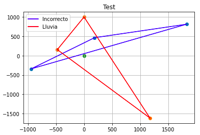

# Planets

## Consieraciones iniciales

* El sol está en la coordenada x = 0, y = 0
* En el día 0, los planetas están alineados en la coordenada x = 0
* Los años son de 365 días.

  
  
## Solución

Como la distancia desde el sol a cada uno de los planetas es conocida, dichas distancias pueden considerarse como un radio. Al conocer también la velocidad angular de los planetas en grados, es posible conocer el ángulo en función del día.
    
Con estas condiciones conocidas: un radio y un ángulo, es posible saber la posición de cada uno de los planetas en un eje cartesiano x e y haciendo uso de las funciones seno (sin) y coseno (cos). Esta lógica se plasma en la función _planets_positions_ que toma como argumento el número del día.

Comprobando las funciones sin() y cos() con ángulos conocidos, se determina que la función tiene los argumentos de entrada en radianes. Los planetas que giran en sentido horario tienen el argumento igual al ángulo, mientras que el planeta que gira en sentido antihorario tiene el argumento como 360 restando el ángulo.
  
Adicionalmente todas las posiciones en los ejes cartesianos se redondean a enteros para poder hacer comparaciones correctas en casos de alineación planetaria.

La lógica de alineación se encuentra en la función _aligned_ que toma como argumento de entrada las seis coordenadas de posición.

Teniendo las seis coordenadas de posición: tres pares (x,y) para cada planeta es posible comenzar a construir rectas entre los planetas. En el caso de alineación, se podrán construir dos rectas entre los tres planetas cuando se fija a uno de ellos, dichas rectas tendrán la misma pendiente al ser en realidad la misma recta.

Si la recta trazada a través de los puntos alineados pasa por el sol (x = y = 0) entonces se tendrá una situación de **sequía**, si no pasa por el sol se tendrá una condición de clima **óptimo** y si los planetas están desalineados pueden darse las siguientes situaciones:

* Si el triángulo que forman los tres planetas como vértices contiene al sol (x = y = 0) entonces se tendrá clima de **lluvia**. La lluvia tendra un pico cuando el triángulo tenga un máximo de perímetro.
* Si el triángulo que forman los tres planetas como vértices NO contiene al sol (x = y = 0) entonces se tendrá clima **incorrecto**

Para estos casos de no alineación se identifica que el sol queda dentro del triángulo usando la función _is_Inside_ que se basa en el supuesto de que el área del triángulo formado por los planetas equivale a la suma del área de tres triángulos más pequeños que se forman teniendo al sol como vértice.

Se genera una lista con los días de los diez años a los que se les aplica las funciones ya mencionadas para obtener como salida una etiqueta de clima y la suma del perímetro del triángulo.

Se generan dataframes a partir de la lista para obtener las respuestas. Adicionalmente se presentan anexos con un par de pruebas: prueba del sol como punto interior del triángulo formado por los planetas y la condición de clima "óptimo".

En el gráfico se muestran un par de triángulos, uno de ellos con el sol como punto interior y que además corresponde a un día de pico de lluvia (rojo).

